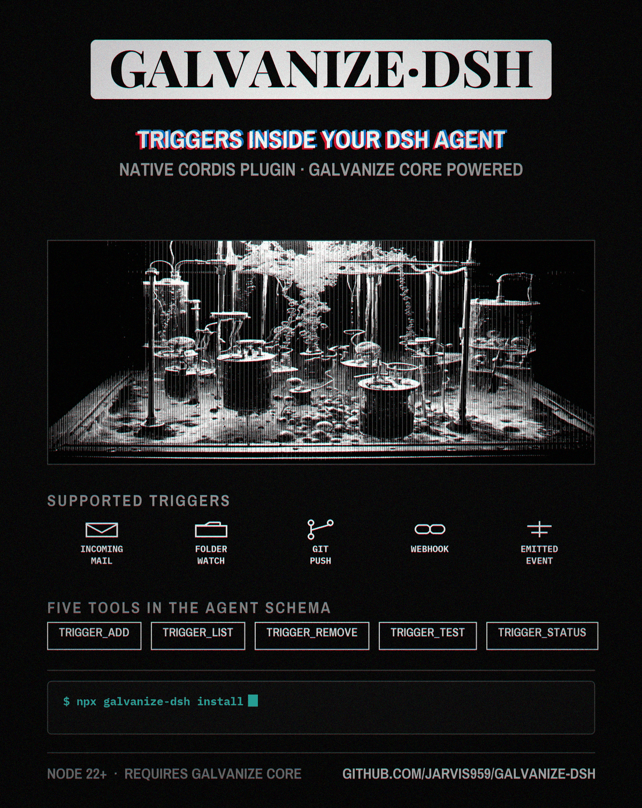

# galvanize-dsh

**Give your DeepSeek Harness agent a way to wake itself up.** Once this
bundle is installed, your DSH agent can register event triggers by itself:
a file landing in a folder, an email arriving, a webhook firing, a git push.
When one happens, the **galvanize**
core spawns a **fresh headless DSH session** with your prompt and the event's
data, so "wake me when a resume shows up in my downloads" is a real push
trigger, not a poll job. The plugin itself is a thin, verified client: five
`trigger_*` tools in the agent schema, every answer coming from the core's
versioned local API. Installation ends by *proving the plugin loaded* —
a headless boot-probe plus three green checks, because a broken DSH plugin
fails as a silent no-op and we refuse to guess.

## Install

```bash
# 0. prerequisites:
#    - Node ^22.19 || >=24        - DSH set up, `dsh` on PATH
#      (npm install -g @deepseek-ai/dsh)
#    - the galvanize core installed and its daemon running
#      (companion project by the same author; publishing to PyPI as
#       `galvanize` shortly — until then, install it from source)

# 1. install the bundle into your DSH profile and prove it loaded:
npx galvanize-dsh install

# 2. create your first trigger (any shell, or just ask your agent in chat):
galvanize add folder ~/inbox --name triage --wake dsh \
  --prompt 'Read {file} and write a triage summary to ~/inbox-out/{file}.md'

# 3. drop a file. A minute later the summary exists:
echo hello > ~/inbox/demo.txt
```

`install` defaults to the `web` profile (`--profile <p>`), bootstraps the
headless wake profile automatically, runs a boot-probe, and only prints
**LOADED** when all three checks pass:

```
  ✔ core /version handshake        core 0.1.2, api 1
  ✔ patch row 'galvanize/tools'    row present, package resolvable
  ✔ plugin heartbeat               plugin 0.1.2, core_api_ok=true, 3s ago
LOADED: all three checks green.
```

From a git clone instead of npm: `npm ci && node lib/cli.js install`.

## In-chat, the agent does the rest

With the bundle mounted, five tools sit in the DSH agent's schema:

| Tool | What it does |
|---|---|
| `trigger_add` | register a trigger (folder / webhook / emit / imap) — *use instead of a poll job whenever the user describes an event* |
| `trigger_list` | what's watching, with settings |
| `trigger_test` | fire a synthetic event through the real dispatch path |
| `trigger_status` | honest health: daemon, lane, last fire, fires today, last error |
| `trigger_remove` | take one out (route cleanup included) |

So *"wake me when a lab report lands in my inbox"* is one sentence — the
agent creates the trigger, test-fires it once so you watch it work, and
forgets about it until the event happens.

## How it works

```
event ── galvanize core ── wake ──▶ dsh --profile headless "<your prompt>"
 (folder/        (dedupe, cooldown,          │
  mail/webhook/   routes, delivery)          ▼
  git/emit)                          fresh DSH session
                                     with trigger_* tools
```

- **Thin client:** no wake or trigger logic in JS; everything proxies to the
  core's loopback API (`GET /version`, `POST /manage/<op>`, bearer token).
  Same behavior as the core's plugins for Hermes/Claude/Codex — one brain,
  many harnesses.
- **Exactly-one-surface:** plugin and `galvanize mcp` never coexist; the
  active one registers itself in `~/.galvanize/surfaces.json`.
- **Verification is the product:** DSH loads a broken plugin as a silent
  PENDING fiber. The heartbeat file + installer checks exist so nobody ever
  ships "should be fine."

## Requirements

| | |
|---|---|
| OS | Windows · Linux · macOS |
| Node | `^22.19 \|\| >=24` (DSH's own range) |
| DSH | `dsh` on PATH or `$DSH_BIN` set |
| galvanize core | ≥ 0.1.0 with the `serve` API |

## Development

```bash
npm ci && npm run build && npx vitest run && npx publint
```

`src/index.ts` (tools) · `src/core-client.ts` (serve client) ·
`src/cli.ts` (installer/verify) · `test/` (18 tests vs a stub core, no DSH
needed).

## License

MIT
